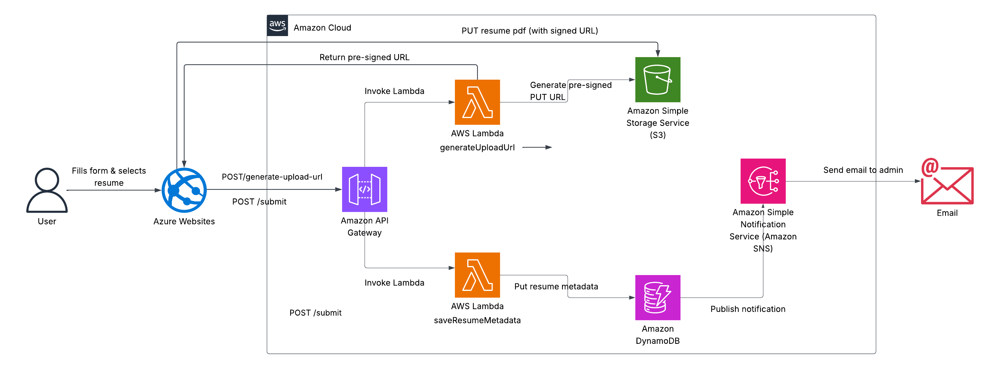

# 🧠 Serverless Job Application System (AWS Full-Stack)

A full-stack, serverless job application platform built entirely on AWS — including a secure, mobile-friendly frontend and a cloud-native backend using Lambda, S3, DynamoDB, SNS, and API Gateway.

---

## 📦 Features

- 🔐 Secure resume upload using **pre-signed S3 URLs**
- 🧠 Stateless business logic via **AWS Lambda**
- 🗃️ Resume metadata stored in **DynamoDB**
- 📩 Admin notified by **SNS email** on new application
- 🌐 API exposed through **API Gateway**
- 🖥️ Mobile-ready **HTML/CSS frontend**
- ☁️ Fully serverless — no backend server needed

---

## 🗂️ Architecture



---

## 🧱 Technologies Used

- **Frontend:** HTML, CSS, JavaScript
- **Backend:** AWS Lambda (Node.js)
- **Storage:** S3 (for files), DynamoDB (for metadata)
- **API Gateway:** REST API endpoints
- **Messaging:** SNS (email notifications)
- **Security:** IAM, S3 CORS, pre-signed URLs

---

## 🌍 Live Endpoints

| Route                  | Method | Description                      |
| ---------------------- | ------ | -------------------------------- |
| `/generate-upload-url` | POST   | Returns pre-signed S3 URL        |
| `/submit`              | POST   | Stores metadata, sends SNS email |

---

## 📁 Project Structure

```
frontend/             → Responsive HTML/CSS frontend
lambda/               → Lambda functions (Node.js)
dynamodb-schema.md    → DB table structure
api-gateway-routes.md → Route config
s3-cors-config.json   → S3 CORS setup
```

---

## 🚀 How to Run Locally

```bash
cd frontend
python3 -m http.server 8080
# Visit http://localhost:8080 in your browser
```

---

## 🧠 Designed & Built By

**Missie Kahsay**  
📍 AWS Certified Solutions Architect  
💡 Backend & Cloud Engineer

---

## 📜 License

This project is [MIT](./LICENSE) licensed.
